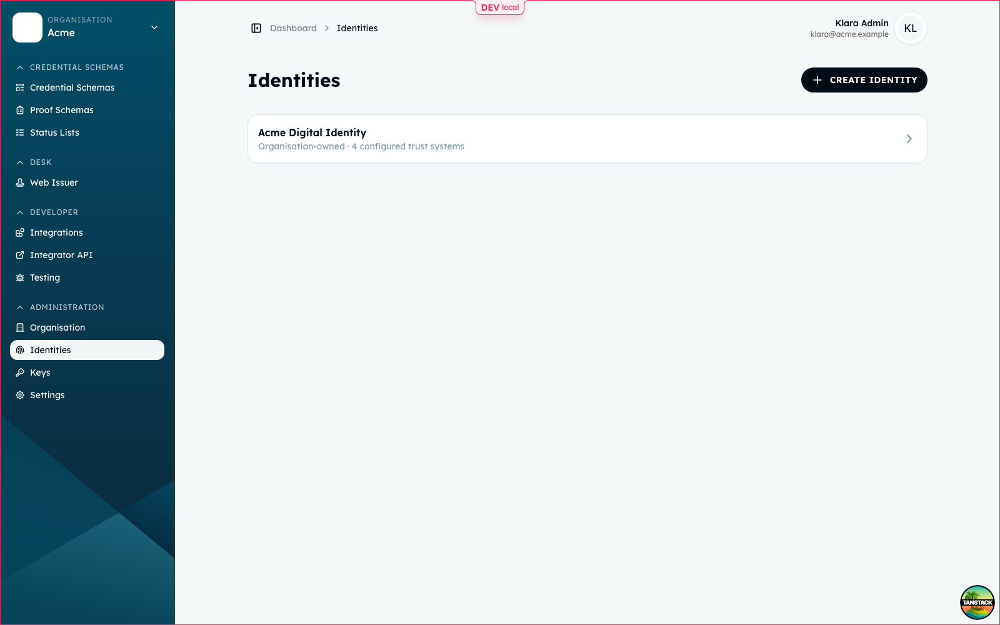
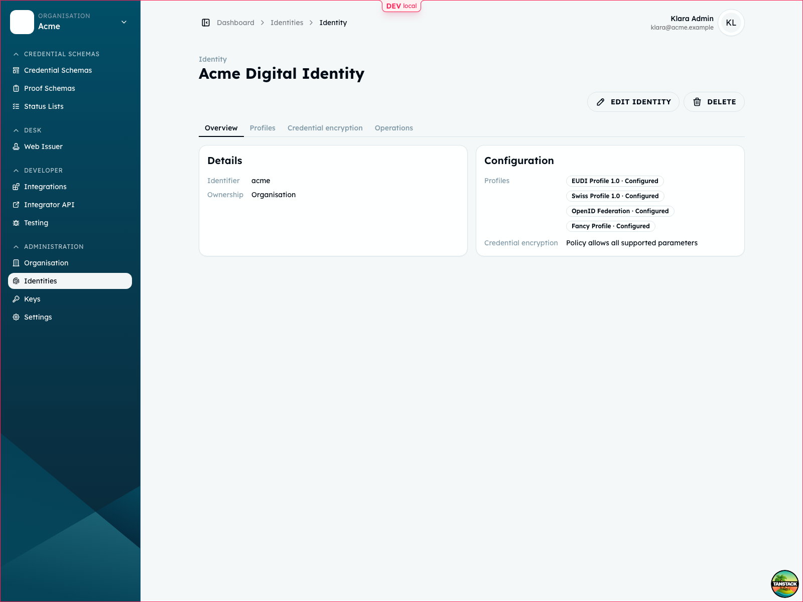
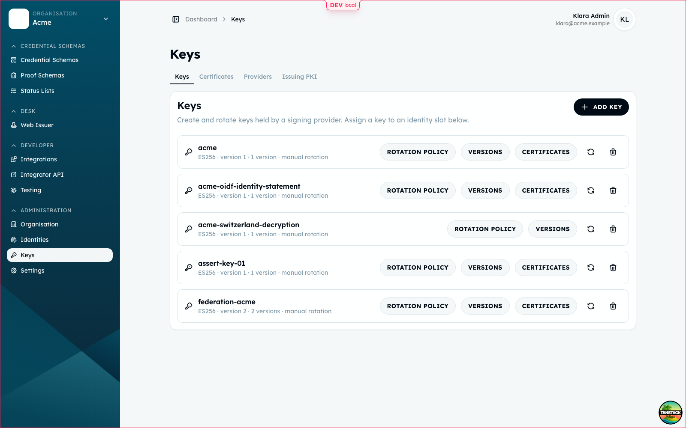

<!-- SPDX-FileCopyrightText: 2026 Ubique Innovation AG and Heidi contributors -->
<!-- SPDX-License-Identifier: Apache-2.0 -->

# Cockpit identity guide

An identity is the issuer or verifier definition used by the platform API. It
belongs to a tenant, has a stable slug, selects one or more trust systems, and
maps protocol operations to signing-service key slots.

The Cockpit is a client of the management API. The API remains the source of
truth, so the same configuration can also be created by automation.

## Where the settings live

The labels and routes can change with the Cockpit release. The current concepts
are:

```text
Organisation
└── Identities
    └── <identity>
        ├── Overview
        ├── Trust systems
        ├── Keys and certificates
        ├── Encryption
        └── Federation

Services
└── Signing providers
```

The menu is conceptual. Use the management API when the UI does not expose a
field or when configuration must be repeatable.

These screenshots show the OSS Cockpit with the repository's local seed data.
They illustrate the current layout; labels and visual styling are not API
contracts.







## Before creating an identity

You need:

- a tenant and a user allowed to manage it;
- a signing provider reachable by the Platform API; and
- the public URLs and trust material required by the selected trust system.

Tenant-scoped identity endpoints accept `ADMIN`, `MANAGER`, or
`SUPER_ADMIN`. Global identity endpoints require `SUPER_ADMIN`.

## Create an identity

Create a tenant identity with:

- a unique `slug` used in public URLs;
- localized `displayName` values;
- an optional `logo`;
- a `defaultTrustSystem`; and
- the configured `trustSystems`.

Example request:

```http
POST /management/v1/identities/tenants/{tenantId}
Content-Type: application/json

{
  "slug": "demo-issuer",
  "displayName": {
    "en": "Demo issuer"
  },
  "defaultTrustSystem": "EUDI",
  "trustSystems": ["EUDI", "Custom"]
}
```

`defaultTrustSystem` is used when an operation does not specify another
configured trust system. An identity can support several trust systems at once.

`Default` is not a framework to configure. It is the global fallback used when
no more specific trust-system configuration applies.

## Select a profile

A trust system identifies the ecosystem or trust infrastructure. A profile is a
versioned issuance or presentation policy within that system. The profile
controls protocol details such as client-ID schemes, request encryption, and
required trust material.

The current profile identifiers are:

| Profile | Use | Current policy summary |
| --- | --- | --- |
| `EUDI_ISSUANCE_2026_1` | EUDI credential issuance | EUDI access certificates, HAIP credential policy, encrypted requests |
| `SWISS_ISSUANCE_2026_1` | Swiss credential issuance | Swiss trust registry, ES256, encrypted transport |
| `OIDF_ISSUANCE_2026_1` | OpenID Federation issuance | Federation entity statements and operator-managed signing |
| `CUSTOM_ISSUANCE_2026_1` | Operator-defined issuance | Operator-managed PKI and X.509 SAN DNS |
| `EUDI_PRESENTATION_2026_1` | EUDI presentation verification | Access certificates, HAIP request policy, `x509_hash` |
| `SWISS_PRESENTATION_2026_1` | Swiss presentation verification | Swiss trust registry, encrypted `direct_post.jwt`, `decentralized_identifier` |
| `OIDF_PRESENTATION_2026_1` | Federated presentation verification | Federation entity identifier, encrypted `direct_post.jwt`, `openid_federation` |
| `CUSTOM_PRESENTATION_2026_1` | Operator-defined presentation verification | Operator PKI and X.509 SAN DNS, `x509_san_dns` |

Choose a profile compatible with the identity's trust system. The profile is
operational configuration, not a replacement for the trust-system setup below.

## Assign key slots

An identity key slot names the operation and points to a key held by the signing
service. Configure the provider and key before enabling protocol traffic.

| Slot type | Current meaning |
| --- | --- |
| `CREDENTIAL_SIGNING` | Signs credentials issued by the identity. |
| `IDENTITY_STATEMENT` | Signs identity, trust, or issuer statements. |
| `PRESENTATION_SIGNING` | Signs verifier requests or presentation metadata. |
| `DECRYPTION` | Decrypts encrypted protocol requests or responses. |
| `OPERATION` | Performs a provider-specific cryptographic operation. |
| `FEDERATION` | Stores a federation-specific signing assignment when required by a provider. OIDF federation currently resolves its effective signing key from the identity-statement slot. |
| `STATUS_LIST` | Signs status-list artifacts. |

The slot request contains `type`, `trustSystem`, `operation`, `keyId`,
`providerId`, an optional `certificateId`, `order`, and provider-specific
`configuration`. The UI may expose these as separate fields.

Tenant-scoped slot endpoints are:

```text
GET /management/v1/identities/tenants/{tenantId}/{identityId}/slots
PUT /management/v1/identities/tenants/{tenantId}/{identityId}/slots
GET /management/v1/identities/tenants/{tenantId}/{identityId}/slots/{slotId}
DELETE /management/v1/identities/tenants/{tenantId}/{identityId}/slots/{slotId}
```

The same resources are available under `/management/v1/identities/{identityId}`
for global administration.

## Configure trust systems

The trust configuration resource is selected by issuer and trust-system name:

```text
GET /management/v1/identities/issuers/{issuerId}/trust-systems/{trustSystem}
PUT /management/v1/identities/issuers/{issuerId}/trust-systems/{trustSystem}
```

### EUDI

Configure the EUDI verification trust anchors and, when applicable, the
platform's own EUDI PKI. EUDI identity-statement and presentation-signing slots
use an access certificate. Credential-signing slots use a credential-signing
certificate. Status-list slots use a status-list certificate profile.

The certificate chain is managed separately:

```text
PUT /management/v1/identities/issuers/{issuerId}/trust-systems/EUDI/keys/{keyId}/certificate-chain
```

EUDI issuance profiles require encrypted authorization requests. Configure a
`DECRYPTION` slot and credential-encryption policy before enabling those flows.

### Switzerland

Configure the Swiss DID, registry endpoints, status-registry details, trust
registry client credentials, identity statement, issuance statements, and the
Swiss verification trust anchor. The resource fields are:

```text
swissDid
swissRegistryBaseUrl
swissStatusRegistryApiUrl
swissStatusRegistryPartnerId
swissTrustRegistryAuthoringUrl
swissTrustRegistryTokenUrl
swissTrustRegistryClientId
swissTrustRegistryClientSecret
swissTrustRegistryRefreshToken
swissIdentityStatement
swissIssuanceStatements
swissVerificationTrustAnchor
```

Refresh registry-backed data with:

```http
POST /management/v1/identities/issuers/{issuerId}/trust-systems/Switzerland/refresh
```

Keep client secrets and refresh tokens server-side. Do not put them in
Cockpit screenshots, browser configuration, or committed files.

### OIDF

OpenID Federation uses signed entity statements. Assign an identity-statement
signing slot and configure the federation resource:

- `authorityHints`: absolute HTTP(S) federation entity identifiers;
- `authority`: whether this identity acts as an authority;
- `subordinateIds`: subordinate entity identifiers; and
- `credentialSchemeIds`: credential schemes exposed by the entity.

When enabled, the federation endpoints are:

```text
GET /federation/{slug}/.well-known/openid-federation
GET /federation/{slug}/fetch
GET /federation/{slug}/list
```

An identity does not need to be an authority to participate in a federation.

### Custom

Custom trust systems use operator-managed PKI and out-of-band trust. Set the
identity's `customProfileName`, assign the required signing and decryption slots,
and publish the trust material expected by the consuming wallets or verifiers.
The platform does not turn `customProfileName` into a registry or a trust anchor.

## Encryption

Credential encryption is configured per identity and can be read or changed at:

```text
GET /management/v1/identities/tenants/{tenantId}/{identityId}/credential-encryption
PUT /management/v1/identities/tenants/{tenantId}/{identityId}/credential-encryption
```

The encryption policy and `DECRYPTION` slot must agree with the selected profile.
For encrypted authorization requests, the public encryption key must be
published through the relevant issuer metadata.

## Check readiness

An identity's status reflects whether its configured operations can run:

| Status | Meaning |
| --- | --- |
| `NOT_IN_USE` | No active protocol operation uses the identity. |
| `SETUP_INCOMPLETE` | Required identity, trust, provider, key, or certificate data is missing. |
| `CONFIGURED` | Required configuration is present. |
| `NEEDS_ATTENTION` | Configuration exists but a dependency, certificate, or external trust service needs action. |

Check these items before testing a flow:

1. The issuer or verifier has a public URL resolvable by the wallet.
2. Every required slot references an enabled provider and existing key.
3. Required certificate chains are uploaded and valid for the profile.
4. Trust registries, federation endpoints, and verification anchors are reachable.
5. The selected issuance or presentation profile matches the trust system.

The identity API also exposes grants and federation configuration:

```text
GET /management/v1/identities/tenants/{tenantId}/{identityId}/grants
GET /management/v1/identities/tenants/{tenantId}/{identityId}/federation
PUT /management/v1/identities/tenants/{tenantId}/{identityId}/federation
```

Signing grants authorize protocol services to use the identity's slots. A
configured key without the corresponding grant is not sufficient for a running
issuer or verifier.

See [API structure](api-structure.md), [OpenAPI contracts](api-contracts.md), and
[the glossary](glossary.md) for route groups and terminology.
